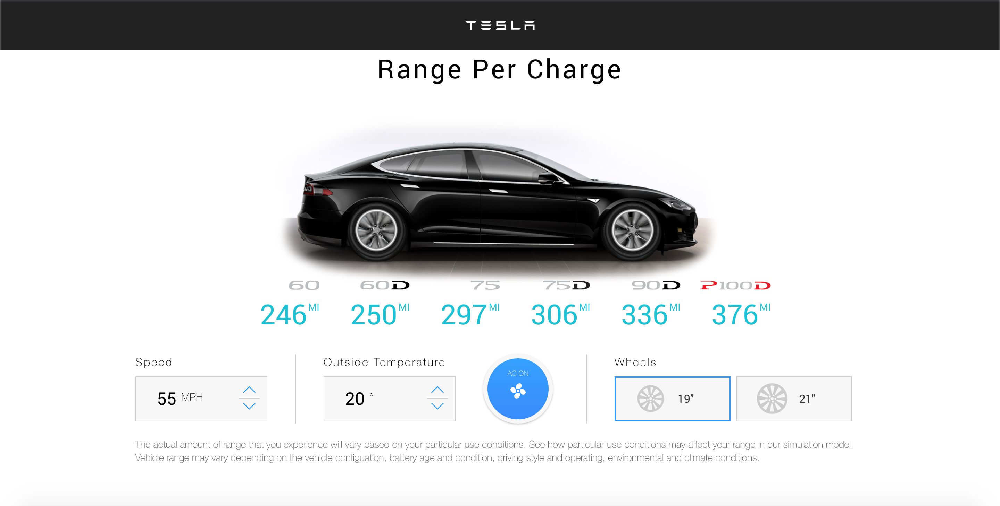

# Description
This project is a React version of Tesla's Battery Range Calculator.
Check it out here: http://tesla-range-calculator-subia-ansari.surge.sh

# Features
You can check the battery range of a Tesla car according to:
* Speed (mph)
* Outside Temperature (C)
* Air Conditioning or Heat (on/off)
* Size of wheels (19" or 21")